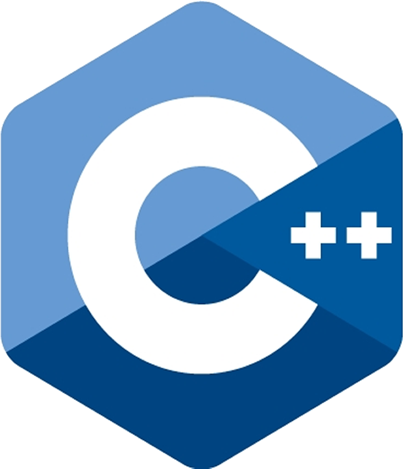
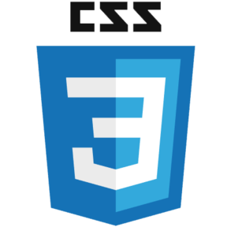
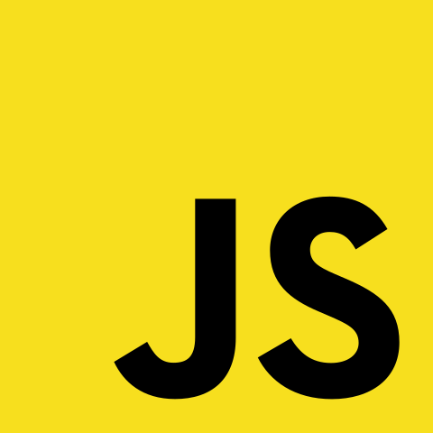

<h1>Vinod Polinati</h1>

<!-- Description about me -->
<h2 align="center">  About me 👨‍💻 </h2>

Supp  
- I am <b>Vinod Polinati</b> better known as 'Vinod'🕵🏼‍♂️  
  - A Crazy, enthusiastic, energetic computer science engineering student skilled in leadership, with a strong foundation in logical reasoning, and cross-platform coding. In search of a role at a well reputed organisation a role where I can utilise my skills and also enhance the organisation's growth. 
- I am from <strong>India</strong> 
   

<!-- Social icons section -->
<h1 align="center"> Social Media: </h1>
  

    
    
    
  

</h1>

### 🧐 More About Me:
<table style="border: none;">
  <tr style="border: none;">
    <td style="border: none;">
      <ul>
        <li>
          🔭 I’m currently studying at *VIIT*
        </li>
        <li>
          🌱 I’m currently learning Python  
        </li>
        <li> 
          All of my projects are available on <a style='text-decoration:none;color:red' target='_blank' href="https://github.com/vinod-polinati?tab=repositories">GitHub</a>
        </li>
        <li>
          📫 Feel free to contact me on <a href="https://www.linkedin.com/in/vinod-polinati-77793b207/">LinkedIn</a>
        </li>
        <li>
          🧠 I'm learning Machine Learning and Data Science
        </li>
    </td>
  </tr>
</table>
   

<!-- languajes and skills section -->

<h1 align="center"> Languages/Frameworks I'm good at: </h1>

  <code></code>
  <code></code>
  <code></code>
  <code></code>
  <code></code>
  <code></code>

 

<h1 align="center"> Languages/Frameworks I'm learning: </h1>

  <code></code>
  <code></code>

 

<h1 align="center"> Environments I work with: </h1>

  <code></code>
  <code></code>
  <code></code>

 

<!-- GitHub stats section -->

## 📊 Github stats

<!-- Based on: https://github.com/anuraghazra/github-readme-stats -->

   
  
  
   

<!-- Projects section -->

## 📘 My top projects

<!-- Bassed on: Repo info cards - https://github.com/anuraghazra/github-readme-stats -->

  

    
  

  
&#8192;

&#8192;

&#8192;

 

  

